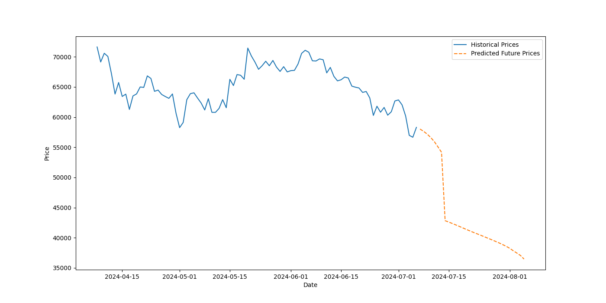
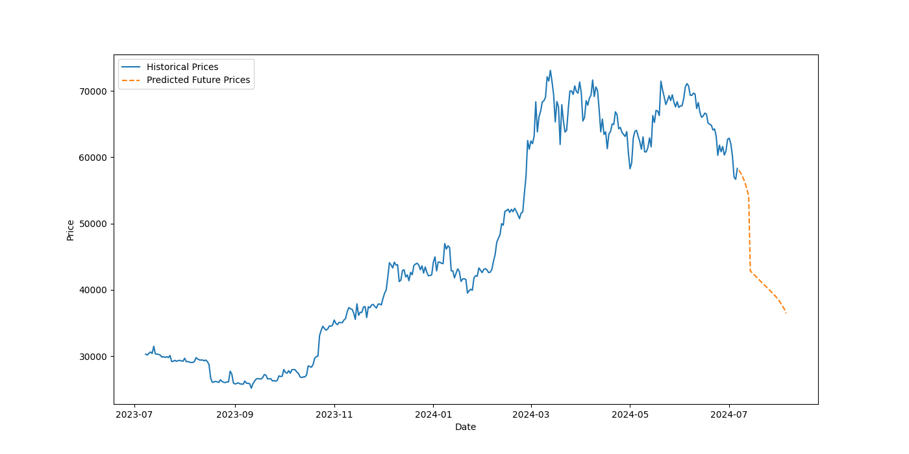
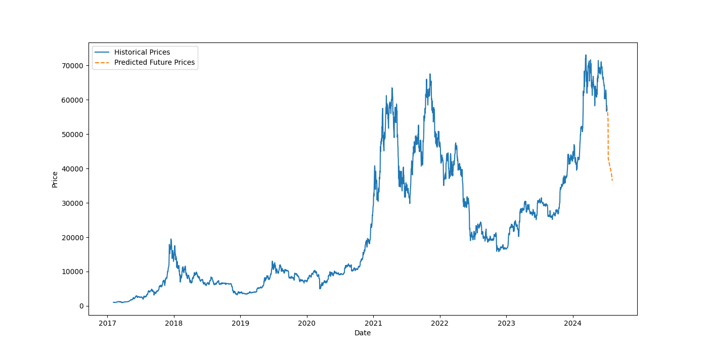
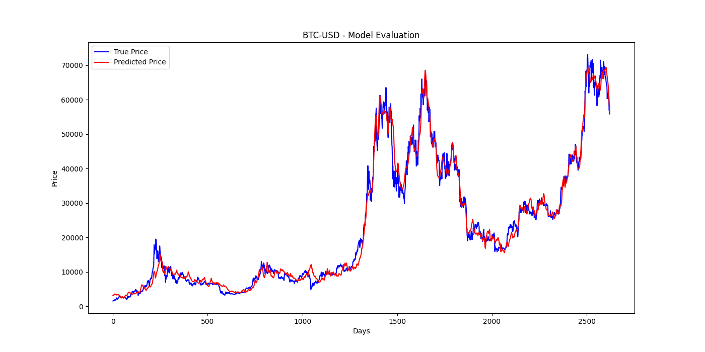

# [PYTORCH] Price Prediction with LSTM

## Overview

This project aims to predict stock prices using Long Short-Term Memory (LSTM) networks.
The model is trained on historical stock data, which includes various technical indicators.
The pipeline includes data preprocessing, feature engineering, model training, and prediction.

## Setup

### Requirements

Ensure you have Python 3.11 installed. Install the necessary packages using:

```bash
pip install -r requirements.txt
```

## Configuration

The config.json file contains all the configuration parameters required for training and prediction.

Example config.json:

```json
{
  "ticker": "BTC-USD",
  "start_date": "2017-01-01",
  "look_back": 60,
  "look_forward": 30,
  "epochs": 100,
  "batch_size": 64,
  "learning_rate": 0.001,
  "model_path": "model.pth"
}
```

## Usage

### Training

To train the model, run:

```bash
python src/train.py  --config config.json
```

### Prediction

To predict stock prices, run:

```bash
python src/predict.py --config config.json
```

### Run all

To run the entire pipeline, run:

```bash
run.sh
```

### Structure

`src/data_loader.py` handles data loading, preprocessing, and feature selection.

`src/feature_engineering.py` calculates various technical indicators used as features for the model.

`src/model.py` contains the definition of the LSTM model and the early stopping class.

`src/train.py` script preprocesses the data, trains the model, and evaluates it.

`src/predict.py` script preprocesses the data, loads the trained model, and generates predictions.

### Example BTC-USD (prediction.png)





### Evaluation



## License

This project is licensed under the MIT License - see the [LICENSE](LICENSE) file for details.
