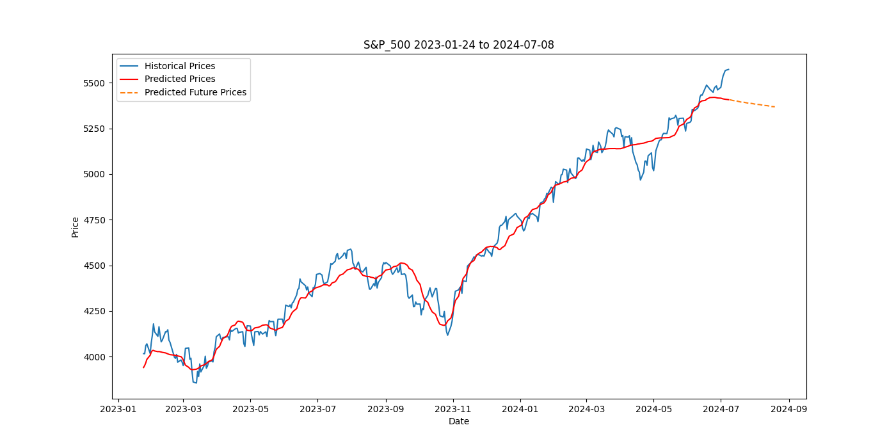
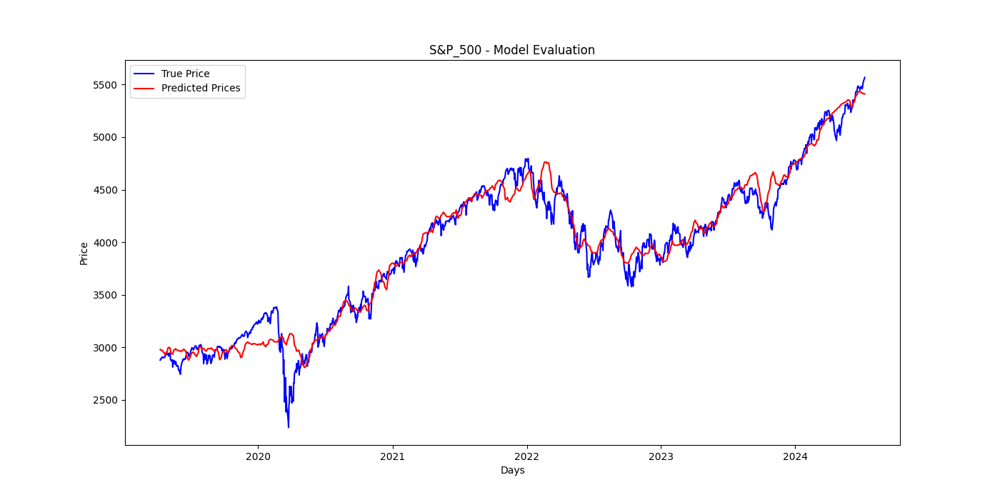

# [PYTORCH] Price Prediction with LSTM

## Overview

This project aims to predict stock prices using Long Short-Term Memory (LSTM) networks.
The model is trained on historical stock data, which includes various technical indicators.
The pipeline includes data preprocessing, feature engineering, model training, and prediction.

## SP500 Prediction Example



## Evaluation

The model is evaluated using the Mean Squared Error (MSE) and Mean Absolute Error (MAE) metrics.
The evaluation results are displayed in the training logs and the evaluation plot.



## Setup

### Requirements

Ensure you have Python 3.11 installed. Install the necessary packages using:

```bash
pip install -r requirements.txt
```

## Configuration

The config.json file contains all the configuration parameters required for training and prediction.

Example config.json:

```json
{
    "ticker": "^GSPC",
    "symbol": "S&P_500",
    "start_date": "2018-01-01",
    "log_dir": "logs",
    "look_back": 90,
    "look_forward": 30,
    "epochs": 100,
    "batch_size": 64,
    "learning_rate": 0.001,
    "model_path": "models",
    "features": [
        "Close",
        "SMA_50",
        "SMA_200",
        "EMA",
        "MACD",
        "MACD_Signal",
        "RSI",
        "Bollinger_High",
        "Bollinger_Low",
        "ATR",
        "OBV",
        "VWAP",
        "ADX",
        "Stochastic",
        "Aroon_Up",
        "Aroon_Down",
        "Williams_R",
        "CMF",
        "CCI",
        "SMA_Agg",
        "MACD_Agg",
        "Bollinger_Bandwidth"
    ],
    "indicator_windows": {
        "SMA_50": 50,
        "SMA_200": 200,
        "EMA": 20,
        "MACD": [
            12,
            26,
            9
        ],
        "RSI": 14,
        "Bollinger": 20,
        "ATR": 14,
        "Stochastic": 14,
        "Aroon": 25,
        "Williams_R": 14,
        "CMF": 20,
        "CCI": 20
    },
    "frequency": "B",
    "target": "Close",
    "best_features": [
        "ADX",
        "EMA",
        "SMA_Agg",
        "MACD_Agg",
        "Bollinger_Bandwidth"
    ]
}
```

## Usage

### Configuration

Update the config.json file with the desired parameters.
PARAMETER DESCRIPTION:

- `ticker`: Stock ticker symbol.
- `symbol`: Stock symbol.
- `start_date`: Start date for the historical data.
- `log_dir`: Directory to store the logs.
- `look_back`: Number of days to look back for the LSTM model.
- `look_forward`: Number of days to predict.
- `epochs`: Number of epochs for training.
- `batch_size`: Batch size for training.
- `learning_rate`: Learning rate for the optimizer.
- `model_path`: Directory to store the trained model.
- `features`: List of features to use for training.
- `indicator_windows`: Dictionary containing the window sizes for the technical indicators.
- `frequency`: Frequency of the data, e.g., 'B' for business days or 'D' for daily.
- `target`: Target variable for prediction.
- `best_features`: List of best features selected for training from the feature selection process.

### Training

To train the model, run:

```bash
python src/train.py  --config config.json
```

### Prediction

To predict stock prices, run:

```bash
python src/predict.py --config config.json
```

### Run all

To run the entire pipeline, run:

```bash
run.sh
```

#### Explained `run.sh`

```bash
    #!/bin/bash

    # Clear logs
    echo "Clearing logs..."
    rm -rf logs/*.log

    # Clean up the data directory
    echo "Cleaning up the data directory..."
    rm -rf data/*.csv

    # Clean up the png directory
    echo "Cleaning up the png directory..."
    rm -rf png/*.png

    # Train the model
    # if skip_training is set to true in the config file, the training will be skipped
    if [ "$SKIP_TRAINING" = "true" ]; then
        echo "Skipping training..."
    else
        echo "Training the model..."
        python src/train.py --config config.json
    fi

    # Run prediction script
    echo "Running prediction..."
    python src/predict.py --config config.json

```

the `run.sh` script is a bash script that automates the entire pipeline. It clears the logs, data, and png directories, trains the model, and generates predictions.

### Structure

`src/data_loader.py` handles data loading, preprocessing, and feature selection.

`src/feature_engineering.py` calculates various technical indicators used as features for the model.

`src/model.py` contains the definition of the LSTM model and the early stopping class.

`src/train.py` script preprocesses the data, trains the model, and evaluates it.

`src/predict.py` script preprocesses the data, loads the trained model, and generates predictions.

### Output

#### Logs

`logs/data_loader.log` contains the data loading and preprocessing logs.

`logs/feature_engineering.log` contains the feature engineering logs.

`logs/model.log` contains the model training logs.

`logs/train.log` contains the training logs.

`logs/predict.log` contains the prediction logs.

`logs/main.log` contains the main logs.

#### Models

`models/{symbol}_model.pth` contains the trained model.

#### Evaluation

`png/{symbol}_evaluation.png` contains the training and validation loss.

#### Predictions

`png/{symbol}_full.png` contains the prediction plot for the entire dataset.

`png/{symbol}_365_days.png` contains the prediction plot zoomed in on the last 365 days.

`png/{symbol}_90_days.png` contains the prediction plot zoomed in on the last 90 days.

## Contributors

- `Gianluca Mazza` - [LinkedIn](https://www.linkedin.com/in/gianlucamazza/)
- `Matteo Garbelli` - [LinkedIn](https://www.linkedin.com/in/matteo-garbelli-1a0bb3b1/)

## License

This project is licensed under the MIT License - see the [LICENSE](LICENSE) file for details.
